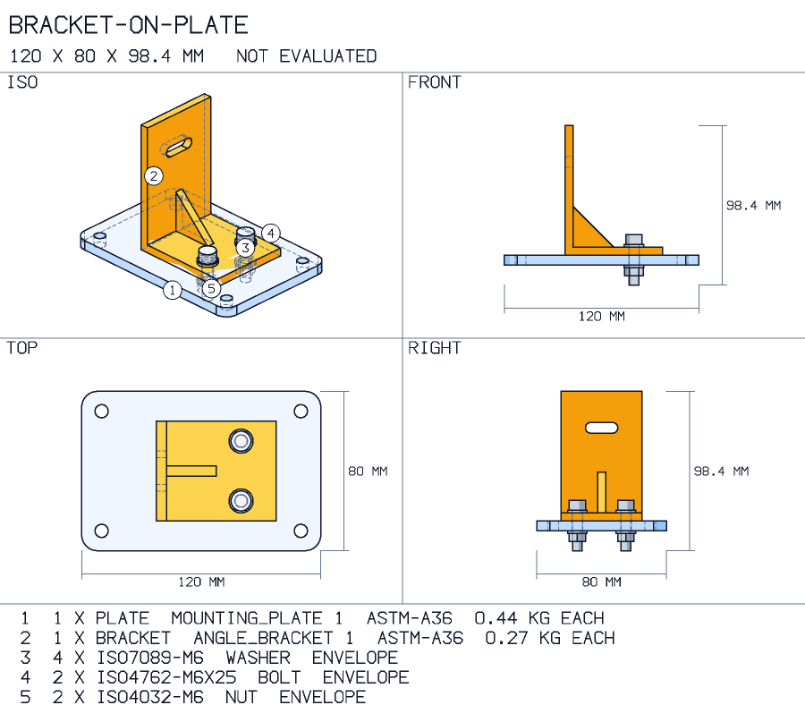
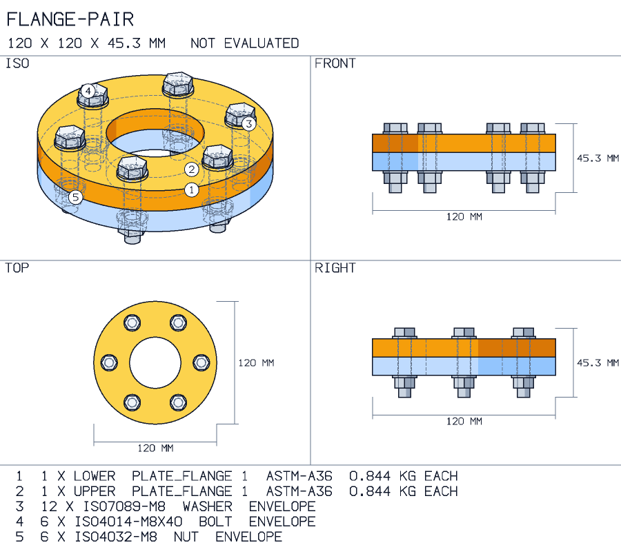
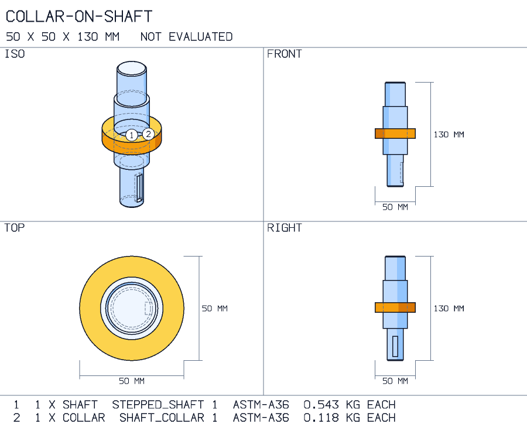
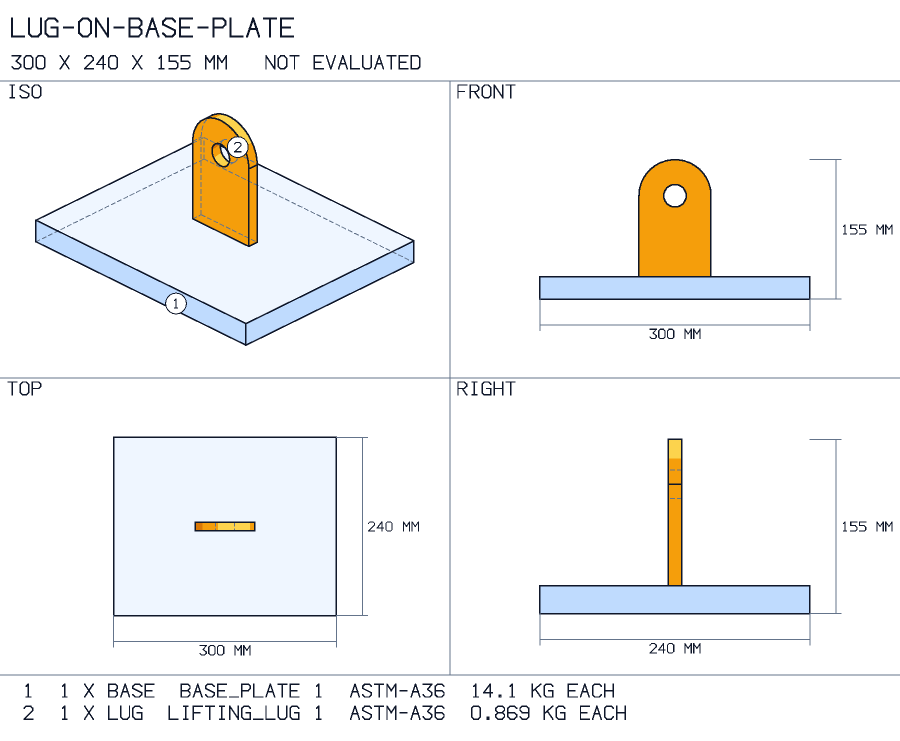
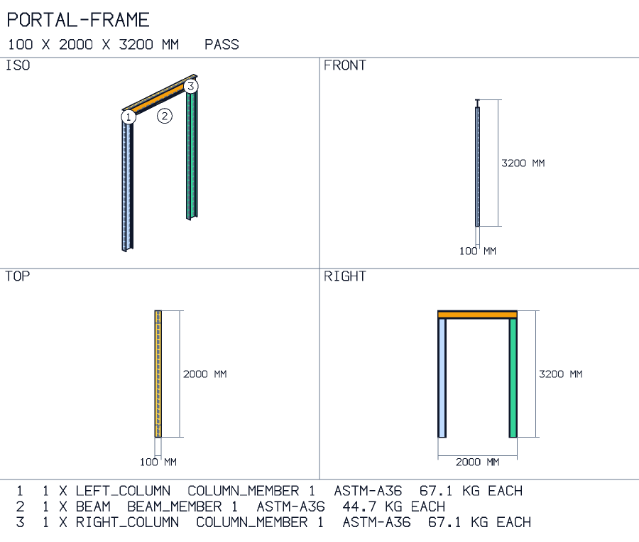

# Combinations: parts placed by the features they share

A single part is rarely the whole question. A bracket goes on a plate, two flanges meet, a
collar sits on a shaft. A **combination** is a short document that names its parts, each
with its own Design Spec, and says how each one meets a part already placed. You write no
coordinates. Anvilate computes where everything goes, checks where the parts meet, draws
the result with every part numbered, and writes a STEP assembly to open in your CAD.

Ask your agent for it in plain words:

> *Bolt that angle bracket to the mounting plate with two M6 cap screws, washers and nuts,
> and show me the assembly.*

The agent writes the combination, calls `build_combination`, shows you the picture with
`render_viewport`, and writes the assembly with `export_artifact`. At the shell:

```bash
anvilate combine examples/combinations/bracket_on_plate.combination.yaml --picture bracket.png --output bracket.step
```

This is not an assembly modeller. There are four mates, the parts are the ones in the
[parts catalog](parts-catalog.md), and anything past that belongs in your CAD, starting
from the STEP file.

## The document

| Key | What it holds |
| --- | --- |
| `parts` | Each part: an `id`, and its `spec`, a whole Design Spec. The first part is the base and stays where it is. |
| `mates` | How each later part meets a part before it. A mate has an `id`, a `kind`, the feature on the part being placed (`place`) and the feature on a part already placed (`on`). |
| `hardware` | What goes in a hole-pattern mate's holes: a `bolt` and its `length`, and optionally a `washer` and a `nut`, by designation; or a dowel `pin` (`ISO2338-6`) and its `length`. One goes in every hole of the mate. A bolted entry may also state the `load` the joint carries in shear, its `bolt_material` and a `min_safety_factor`. |
| `keys` | A parallel key on a `shaft_in_bore` mate: its `width`, `height` and `length`, and which of the shaft's keyways it sits in (`keyway`, from 1). With a `torque` and the two allowables it is screened too. |
| `welds` | A weld on a face-to-face mate: its `type` and `size`. Declared, not drawn. |

### The four mates

| Kind | What it does | What each side names |
| --- | --- | --- |
| `hole_pattern` | Puts one face on another with the listed holes coaxial, pair by pair. | a `face`, and `holes` by their tags |
| `face_to_face` | Puts two faces in contact. `offset` opens a gap. | a `face` |
| `edge_flush` | Lines two faces up in one plane. `offset` steps one back from the other. | a `face` |
| `shaft_in_bore` | Makes two axes one. `fit` states the ISO 286 fit the two are made to, such as `H7/g6`. | an `axis` (x, y or z through the part's origin) or a `feature`, a hole by its tag |

A `face` is one of the part's six outermost faces by direction: top, bottom, left, right,
front or back. A hole's tag is the one the part's own spec gave it; `build_part` lists them
in the geometry summary.

A part needs enough mates to hold it still. One that is left free to slide is refused,
saying which way it can still move and what would fix it. Two mates that cannot both be
met are refused naming both. A part that can still turn about a shared axis, like a collar
on a shaft, is placed as built and the card says so; `rotation_deg` on a mate turns it.

## What is checked

Each of these is an entry on the combination's card.

| Entry | What it says |
| --- | --- |
| each part | The part's own verdict, from its own screen. A part that is drawn and not checked says so here. |
| hole pattern | Whether the mated holes line up, hole by hole. With a fastener in them, they may be out by the room the bolt has; with a declared `position_tolerance`, by that; otherwise they must agree. A mismatch fails and names the holes. |
| bolt clearance | Whether the smallest mated hole admits the bolt at the ISO 273 class asked for (`close`, `normal` or `coarse`), and what to open it to when it does not. |
| bolt length | Whether the bolt fills its nut through the clamped parts and washers, and how much longer it must be when it does not. |
| fit | On a `shaft_in_bore` mate where one part sits inside a bore of the other: whether the bore and the shaft are one nominal size, and with a declared `fit`, what it leaves between them across their tolerances. A collar slid over a smaller step overlaps nothing and fails here. |
| bolt shear, bearing on each part | For a hardware entry that states a `load`: the joint screened as a [bolted connection](spec-screening.md), fed from the mate. Each bolt carries an equal share in single shear, and bears on each part at the thickness its hole goes through and that part's own material. |
| key width, height, length | For a key: whether it is as wide as the shaft's keyway and the hub's keyseat, and the two face each other; whether it stands proud of the shaft and is no taller than the two slots together; whether it is within the keyway with the hub over some of it. |
| key shear, key side bearing | For a key that states its `torque`: the [shaft key screen](machinery-screening.md), over the length of key the hub covers. |
| pin fit | Whether every mated hole is the dowel pin's own diameter. A pin locates by filling its hole, so one in a clearance hole fails and names the holes to ream. |
| pin length | Whether the pin is a length ISO 2338 stocks for its diameter, and sits inside both parts with half its length each side of the plane they meet on. |
| weld | A declared weld, not evaluated: its strength is screened as a `welded_connection` element with its load. |
| interference | Every pair of bodies whose boxes meet is intersected. An overlap fails, naming the pair and the volume they share. |

Fasteners are **envelopes**: a bolt is a cylinder with a head, a nut a hexagon, a dowel
pin a plain cylinder, each from its tabulated size. They show where the hardware goes and what it needs around it. They
carry no thread and are never offered as the fastener's geometry.

A combination exports as validated when its card passes. One that holds parts drawn and
not checked, or a declared weld, and nothing that failed, is written marked unvalidated.
One with a failing entry is refused.

Bolts clamp and dowel pins locate, so a joint that needs both has two hole-pattern mates
between the same two parts: one through the clearance holes, with the bolts, and one
through the reamed holes, with the pins. The two have to place the part in the same
position, and a pattern with pins and no declared tolerance is held to a micrometre.

## Worked combinations

Each is a document in [`examples/combinations`](../examples/combinations) to copy and change.

### A bracket bolted to a plate

One `hole_pattern` mate puts the bracket's foot on the plate with its two holes over the
plate's, and one hardware stack puts a cap screw, two washers and a nut in each.
[`bracket_on_plate.combination.yaml`](../examples/combinations/bracket_on_plate.combination.yaml)



### A flange pair

Two plate flanges face to face, their six holes mated, with six hex bolts.
[`flange_pair.combination.yaml`](../examples/combinations/flange_pair.combination.yaml)



### A collar on a shaft

`shaft_in_bore` puts the collar on the shaft's axis, and an `edge_flush` mate with an
offset puts it 60 mm from the drive end. The mate states its fit, H7/g6, and the card says
what that is at 30 mm: 0.007 to 0.041 mm of clearance.
[`collar_on_shaft.combination.yaml`](../examples/combinations/collar_on_shaft.combination.yaml)



### A lifting lug on a base plate

The lug stands on the plate (`face_to_face`), is set in from two edges (`edge_flush` with
offsets), and is joined by a declared 6 mm fillet weld.
[`lug_on_base_plate.combination.yaml`](../examples/combinations/lug_on_base_plate.combination.yaml)



### A portal frame

Two rolled columns and a beam across their tops, each placed by one contact and two
flush faces.
[`portal_frame.combination.yaml`](../examples/combinations/portal_frame.combination.yaml)



## What comes out

- **A picture.** Four views on one sheet, each part in its own tone and numbered, with the
  parts list underneath. The numbers are the parts list's.
- **A parts list.** Every part with its pattern, material and mass, and every fastener
  with its designation and count.
- **A STEP assembly.** AP242, each part a named component with its own placement, each
  kind of fastener one product placed once per hole. It opens as an assembly whose
  components can be selected and hidden, not as one fused body.
