# Parts you can ask for

Every part on this page is one `element_type` in a Design Spec. Ask your agent for it in
plain words ("a 120 by 80 mounting plate, 6 mm thick, with four M6 clearance holes") and it
writes the spec, calls `build_part`, and shows you the picture. `export_artifact` then
writes a STEP file to open in your own CAD.

A part marked **drawn, not checked** has no strength or fit screen: its picture and its
STEP file are geometry, not a verdict, and its exports carry the unvalidated mark. A part
marked **envelope** is a catalog component drawn from its tabulated size: where it goes,
not how it is made.

A shape that is not on this page belongs in your CAD. Start from the STEP export of the
closest part here.

This page is generated by `tools/parts-catalog/build.py` from the pattern registry.

## Holes and slots

Parts that take holes declare them the same way, positioned from the centre of the face
they are cut into. A hole that does not fit, or that overlaps another, is refused by name
before anything is built.

| Declaration | Fields |
| --- | --- |
| `Hole` | `tag`, `x`, `y`, `diameter`, and `kind`: `through`, `counterbore` (with `counterbore_diameter`, `counterbore_depth`) or `countersink` (with `head_diameter`). `thread` marks it tapped, as data. |
| `HolePattern` | `tag`, `diameter`, and `kind`: `rectangular` (`count_x`, `count_y`, `pitch_x`, `pitch_y`) or `bolt_circle` (`count`, `circle_diameter`, `start_angle_deg`). |
| `Slot` | `tag`, `x`, `y`, `length`, `width`, `angle_deg`. |

Each cut is measurable by its tag: `measure_geometry` answers `feature:<tag>:diameter`,
`feature:<tag>:x` and `feature_count`.

## The parts

### `angle_bracket`

An L bracket: two legs with holes and slots in each, and an optional stiffening rib. **drawn, not checked**.

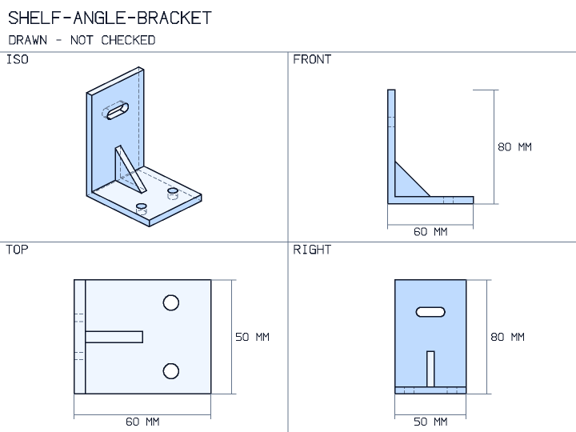

- Required: `name` (text), `base_length` (quantity), `upright_height` (quantity), `width` (quantity), `thickness` (quantity)
- Optional: `rib_thickness` (quantity), `rib_leg` (quantity), `base_holes` (list of Hole), `base_patterns` (list of HolePattern), `base_slots` (list of Slot), `upright_holes` (list of Hole), `upright_patterns` (list of HolePattern), `upright_slots` (list of Slot), `material` (text)
- Outputs: views, step, 3mf
- Example: [`examples/parts/angle_bracket.spec.yaml`](../examples/parts/angle_bracket.spec.yaml)

### `base_plate`

A rectangular column base plate: width, depth and thickness.

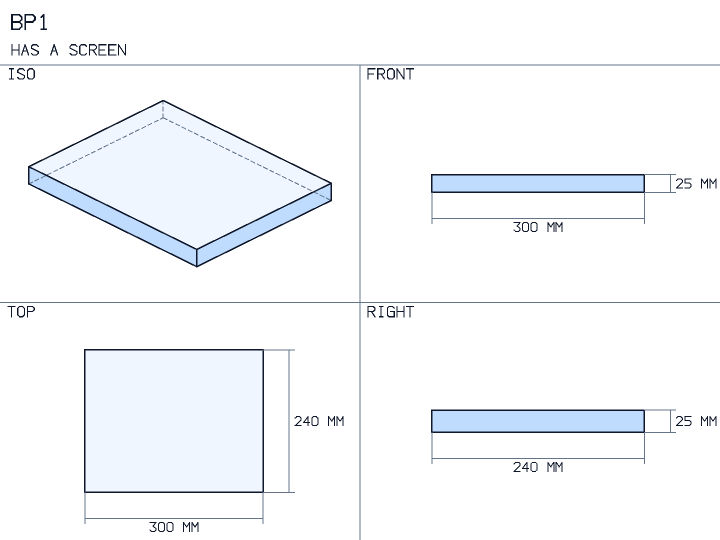

- Required: `name` (text), `width` (quantity), `depth` (quantity), `axial_load` (quantity), `concrete_strength` (quantity)
- Optional: `plate_thickness` (quantity), `cantilever` (quantity), `plate_material` (text)
- Outputs: views, step, 3mf, dxf
- Example: [`examples/base_plate.spec.yaml`](../examples/base_plate.spec.yaml)

### `beam_column_member`

A beam-column cut to length from a named rolled I or H profile.

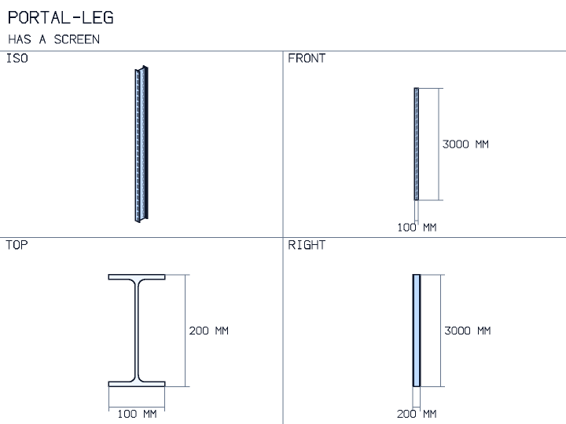

- Required: `name` (text), `section` (CrossSection), `length` (quantity), `axial_load` (quantity), `moment` (quantity), `material` (text)
- Optional: `end_condition` (pinned_pinned | fixed_fixed | fixed_pinned | fixed_free)
- Outputs: views, step, 3mf
- Example: [`examples/parts/beam_column_member.spec.yaml`](../examples/parts/beam_column_member.spec.yaml)

### `beam_member`

A beam cut to length from a named rolled I or H profile.

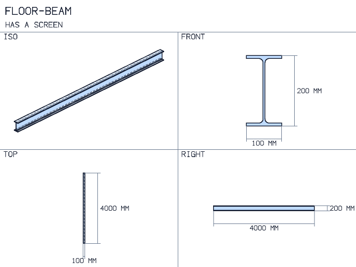

- Required: `name` (text), `section` (CrossSection), `length` (quantity), `support` (cantilever | simply_supported | fixed_fixed | fixed_pinned | overhang), `load` (quantity), `load_type` (point | distributed | triangular | moment), `material` (text)
- Optional: `deflection_limit` (quantity), `load_position` (quantity), `pair_offset` (quantity), `loaded_length` (quantity), `overhang_length` (quantity), `mass_per_length` (quantity), `min_frequency` (quantity), `patch_centered` (true or false), `triangle_mirrored` (true or false)
- Outputs: views, step, 3mf
- Example: [`examples/parts/beam_member.spec.yaml`](../examples/parts/beam_member.spec.yaml)

### `bushing`

A sleeve bushing, plain or with a flange at one end. **drawn, not checked**.

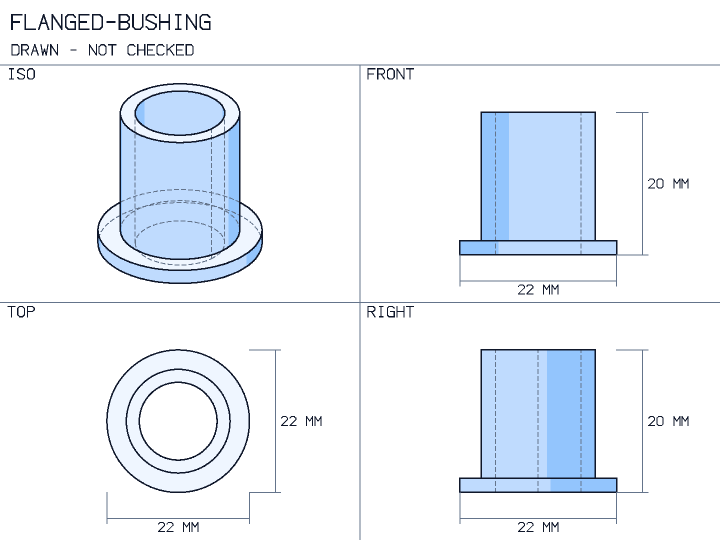

- Required: `name` (text), `outer_diameter` (quantity), `inner_diameter` (quantity), `length` (quantity)
- Optional: `flange_diameter` (quantity), `flange_thickness` (quantity), `material` (text)
- Outputs: views, step, 3mf
- Example: [`examples/parts/bushing.spec.yaml`](../examples/parts/bushing.spec.yaml)

### `clevis`

A fork: a base and two ears with a pin hole through both. **drawn, not checked**.

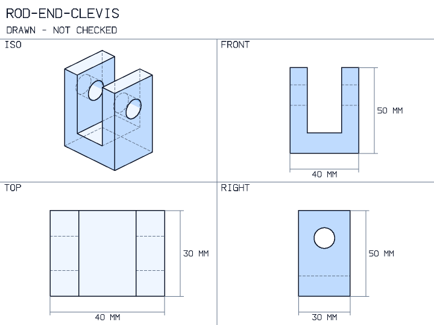

- Required: `name` (text), `width` (quantity), `gap` (quantity), `depth` (quantity), `height` (quantity), `base_thickness` (quantity), `pin_diameter` (quantity), `pin_height` (quantity)
- Optional: `material` (text)
- Outputs: views, step, 3mf
- Example: [`examples/parts/clevis.spec.yaml`](../examples/parts/clevis.spec.yaml)

### `column_member`

A column cut to length from a named rolled I or H profile.

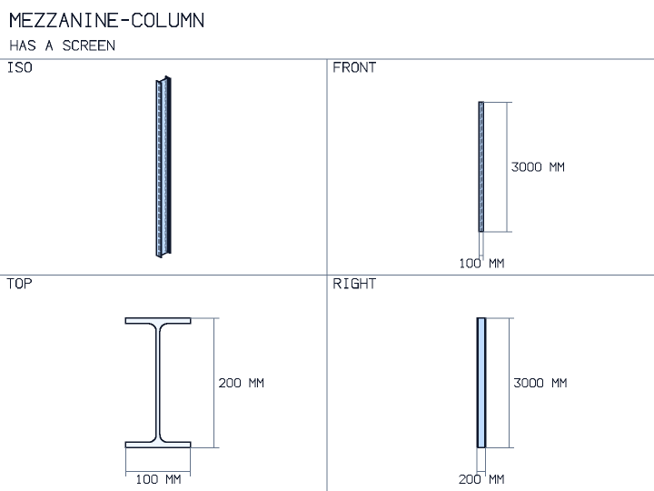

- Required: `name` (text), `section` (CrossSection), `length` (quantity), `axial_load` (quantity), `material` (text)
- Optional: `end_condition` (pinned_pinned | fixed_fixed | fixed_pinned | fixed_free)
- Outputs: views, step, 3mf
- Example: [`examples/parts/column_member.spec.yaml`](../examples/parts/column_member.spec.yaml)

### `cover_plate`

A flat cover: rectangular, round, or round with a central bore.

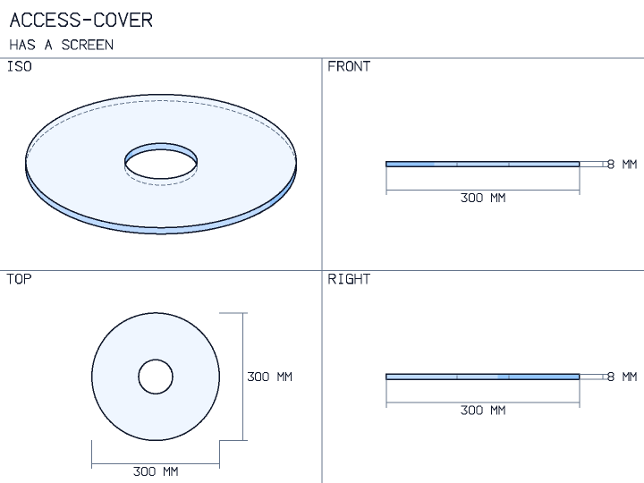

- Required: `name` (text), `pressure` (quantity), `thickness` (quantity), `material` (text)
- Optional: `edge` (simply_supported | clamped), `length` (quantity), `width` (quantity), `diameter` (quantity), `hole_diameter` (quantity), `patch_length` (quantity), `patch_width` (quantity), `deflection_limit` (quantity), `min_frequency` (quantity)
- Outputs: views, step, 3mf, dxf
- Example: [`examples/cover_plate.spec.yaml`](../examples/cover_plate.spec.yaml)

### `enclosure`

An open-topped box with a wall thickness, round corners and floor holes. **drawn, not checked**.

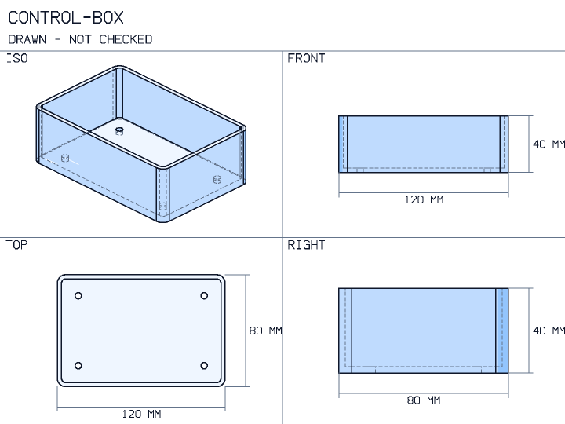

- Required: `name` (text), `width` (quantity), `length` (quantity), `height` (quantity), `wall` (quantity)
- Optional: `floor` (quantity), `corner_radius` (quantity), `floor_holes` (list of Hole), `floor_patterns` (list of HolePattern), `material` (text)
- Outputs: views, step, 3mf
- Example: [`examples/parts/enclosure.spec.yaml`](../examples/parts/enclosure.spec.yaml)

### `helical_compression_spring`

A helical compression spring, drawn as the tube it occupies at its free length. **envelope**.

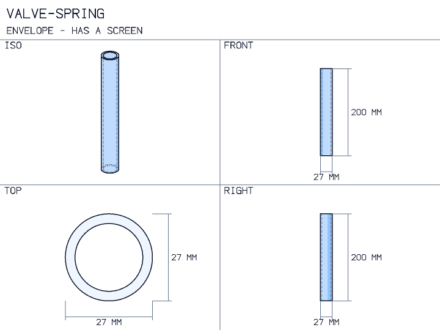

- Required: `wire_diameter` (quantity), `mean_coil_diameter` (quantity), `active_coils` (number), `total_coils` (number), `free_length` (quantity), `operating_force` (quantity), `shear_modulus` (quantity), `elastic_modulus` (quantity), `allowable_shear_stress` (quantity)
- Optional: `end_condition_constant` (number)
- Outputs: views, step, 3mf
- Example: [`examples/parts/helical_compression_spring.spec.yaml`](../examples/parts/helical_compression_spring.spec.yaml)

### `lifting_lug`

A lifting lug (pad eye): a plate with a round top concentric with its pin hole.

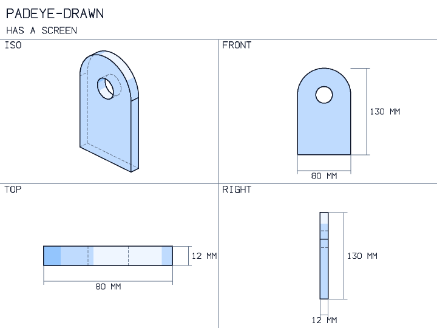

- Required: `name` (text), `width` (quantity), `hole_diameter` (quantity), `thickness` (quantity), `load` (quantity), `material` (text)
- Optional: `hole_height` (quantity)
- Outputs: views, step, 3mf, dxf
- Example: [`examples/parts/lifting_lug.spec.yaml`](../examples/parts/lifting_lug.spec.yaml)

### `mounting_plate`

A flat rectangular plate with holes, hole patterns and slots, and optional round corners. **drawn, not checked**.

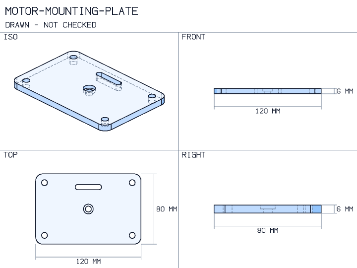

- Required: `name` (text), `width` (quantity), `length` (quantity), `thickness` (quantity)
- Optional: `corner_radius` (quantity), `holes` (list of Hole), `hole_patterns` (list of HolePattern), `slots` (list of Slot), `material` (text)
- Outputs: views, step, 3mf, dxf
- Example: [`examples/parts/mounting_plate.spec.yaml`](../examples/parts/mounting_plate.spec.yaml)

### `plate_flange`

A flat ring flange: a disc with a central bore and a circle of bolt holes. **drawn, not checked**.

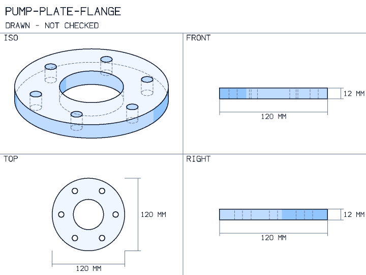

- Required: `name` (text), `outer_diameter` (quantity), `bore_diameter` (quantity), `thickness` (quantity), `bolt_circle_diameter` (quantity), `bolt_count` (whole number), `bolt_hole_diameter` (quantity)
- Optional: `material` (text)
- Outputs: views, step, 3mf, dxf
- Example: [`examples/parts/plate_flange.spec.yaml`](../examples/parts/plate_flange.spec.yaml)

### `pulley`

A V-belt pulley: a disc with a bore and one V groove in its rim. **drawn, not checked**.

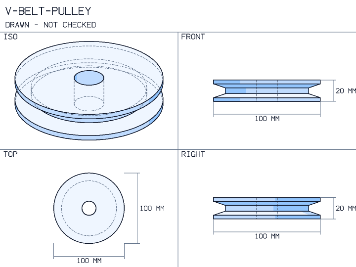

- Required: `name` (text), `outer_diameter` (quantity), `bore` (quantity), `width` (quantity), `groove_depth` (quantity), `groove_width` (quantity), `groove_angle_deg` (number)
- Optional: `material` (text)
- Outputs: views, step, 3mf
- Example: [`examples/parts/pulley.spec.yaml`](../examples/parts/pulley.spec.yaml)

### `rolling_bearing`

A deep-groove ball bearing, drawn as a ring from its ISO 15 boundary dimensions. **envelope**.

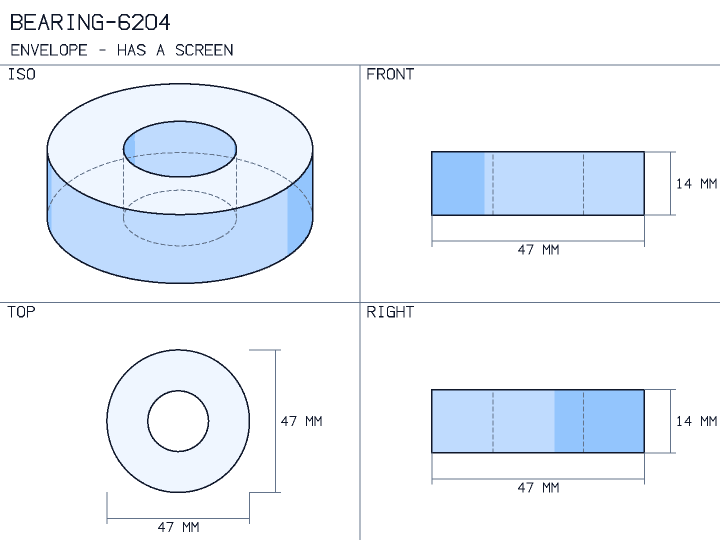

- Required: `dynamic_load_rating` (quantity), `static_load_rating` (quantity), `radial_load` (quantity), `axial_load` (quantity), `radial_factor` (number), `axial_factor` (number), `speed` (quantity), `required_life_hours` (quantity)
- Optional: `life_exponent` (number), `required_static_factor` (number), `designation` (text)
- Outputs: views, step, 3mf
- Example: [`examples/parts/rolling_bearing.spec.yaml`](../examples/parts/rolling_bearing.spec.yaml)

### `shaft_collar`

A plain shaft collar: a ring on a shaft. **drawn, not checked**.

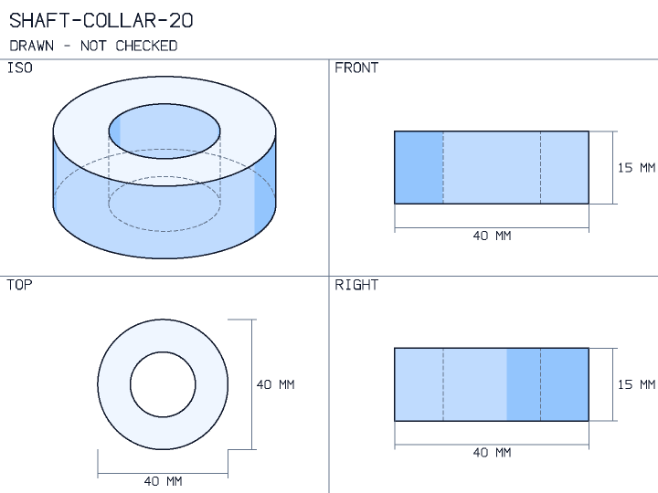

- Required: `name` (text), `bore` (quantity), `outer_diameter` (quantity), `width` (quantity)
- Optional: `material` (text)
- Outputs: views, step, 3mf
- Example: [`examples/parts/shaft_collar.spec.yaml`](../examples/parts/shaft_collar.spec.yaml)

### `shaft_key`

A parallel shaft key: a bar of its width and height.

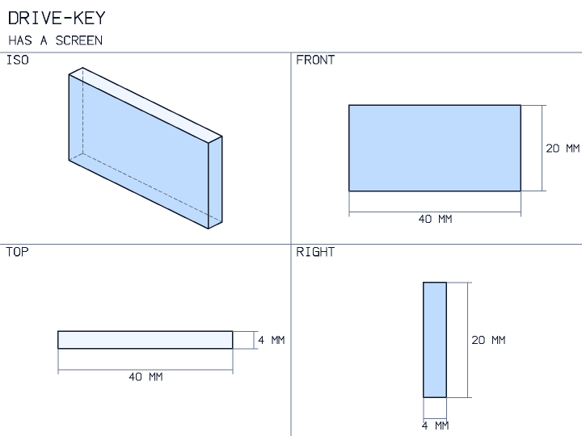

- Required: `shaft_diameter` (quantity), `key_width` (quantity), `key_height` (quantity), `key_length` (quantity), `torque` (quantity), `allowable_shear` (quantity), `allowable_bearing` (quantity)
- Optional: none
- Outputs: views, step, 3mf
- Example: [`examples/parts/shaft_key.spec.yaml`](../examples/parts/shaft_key.spec.yaml)

### `sheet_metal_bracket`

A bracket bent from one sheet (L, U or Z), with its developed flat length. **drawn, not checked**.

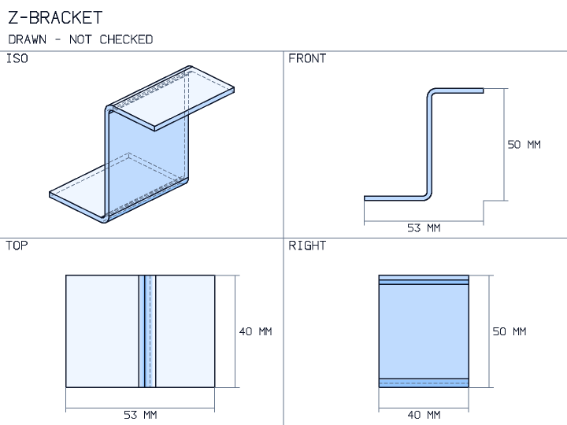

- Required: `name` (text), `thickness` (quantity), `inside_radius` (quantity), `width` (quantity), `flange_a` (quantity), `flange_b` (quantity)
- Optional: `shape` (L | U | Z), `flange_c` (quantity), `k_factor` (number), `k_factor_source` (text), `material` (text)
- Outputs: views, step, 3mf, flat_pattern
- Example: [`examples/parts/sheet_metal_bracket.spec.yaml`](../examples/parts/sheet_metal_bracket.spec.yaml)

### `spacer`

A plain round spacer: a ring of one length. **drawn, not checked**.

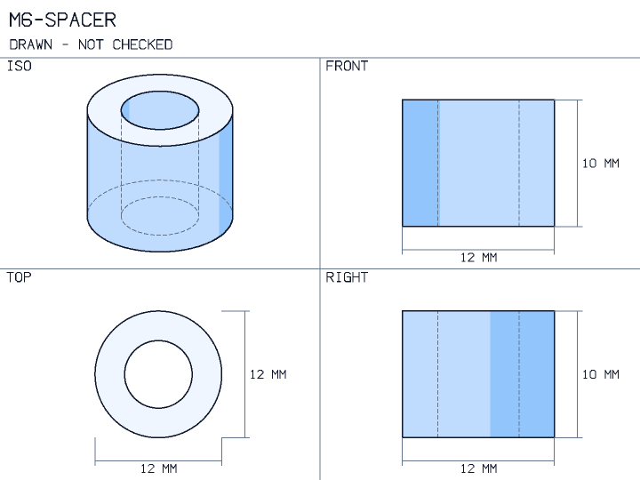

- Required: `name` (text), `outer_diameter` (quantity), `inner_diameter` (quantity), `length` (quantity)
- Optional: `material` (text)
- Outputs: views, step, 3mf
- Example: [`examples/parts/spacer.spec.yaml`](../examples/parts/spacer.spec.yaml)

### `spur_gear_mesh`

A spur gear pair, drawn as its two tip cylinders at their centre distance. **envelope**.

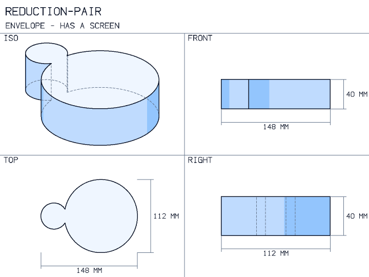

- Required: `pinion_teeth` (whole number), `gear_teeth` (whole number), `module` (quantity), `face_width` (quantity), `pressure_angle` (number), `pinion_torque` (quantity), `bending_geometry_factor` (number), `contact_geometry_factor` (number), `allowable_bending_stress` (quantity), `allowable_contact_stress` (quantity), `pinion_modulus` (quantity), `gear_modulus` (quantity)
- Optional: `minimum_contact_ratio` (number), `overload_factor` (number), `dynamic_factor` (number), `size_factor` (number), `load_distribution_factor` (number), `rim_thickness_factor` (number), `surface_condition_factor` (number)
- Outputs: views, step, 3mf
- Example: [`examples/parts/spur_gear_mesh.spec.yaml`](../examples/parts/spur_gear_mesh.spec.yaml)

### `standoff`

A hexagonal standoff with a hole along its axis, tapped as data. **drawn, not checked**.

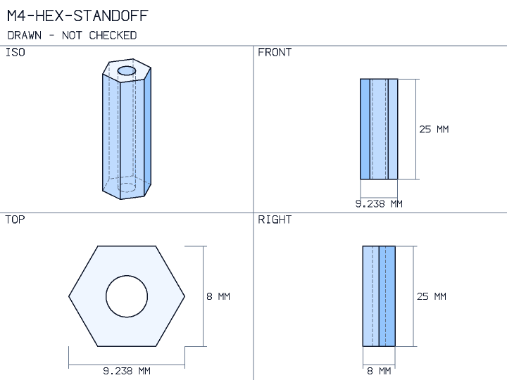

- Required: `name` (text), `across_flats` (quantity), `length` (quantity), `hole_diameter` (quantity)
- Optional: `thread` (text), `material` (text)
- Outputs: views, step, 3mf
- Example: [`examples/parts/standoff.spec.yaml`](../examples/parts/standoff.spec.yaml)

### `stepped_shaft`

A solid round shaft of several diameters, with keyways and chamfered ends. **drawn, not checked**.

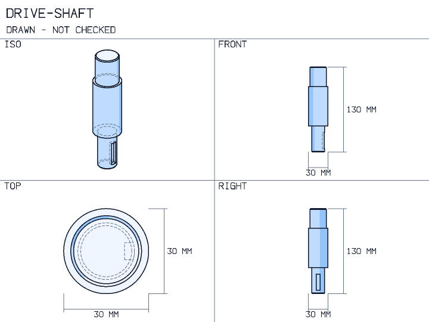

- Required: `name` (text), `steps` (list of ShaftStep)
- Optional: `keyways` (list of Keyway), `end_chamfer` (quantity), `material` (text)
- Outputs: views, step, 3mf
- Example: [`examples/parts/stepped_shaft.spec.yaml`](../examples/parts/stepped_shaft.spec.yaml)

### `t_slot_extrusion`

A T-slot aluminium extrusion cut to length, drawn as an envelope from its designation. **drawn, not checked**, **envelope**.

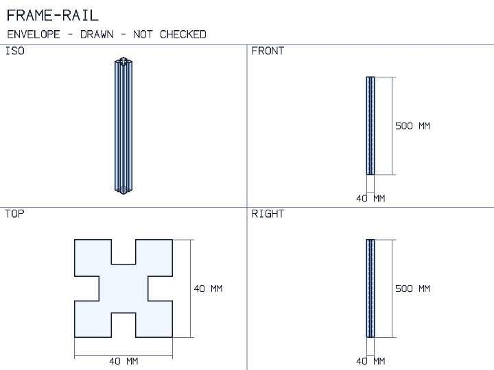

- Required: `name` (text), `designation` (text), `length` (quantity)
- Optional: none
- Outputs: views, step, 3mf
- Example: [`examples/parts/t_slot_extrusion.spec.yaml`](../examples/parts/t_slot_extrusion.spec.yaml)

### `timber_beam`

A sawn timber beam between its supports: dressed width and depth over a span.

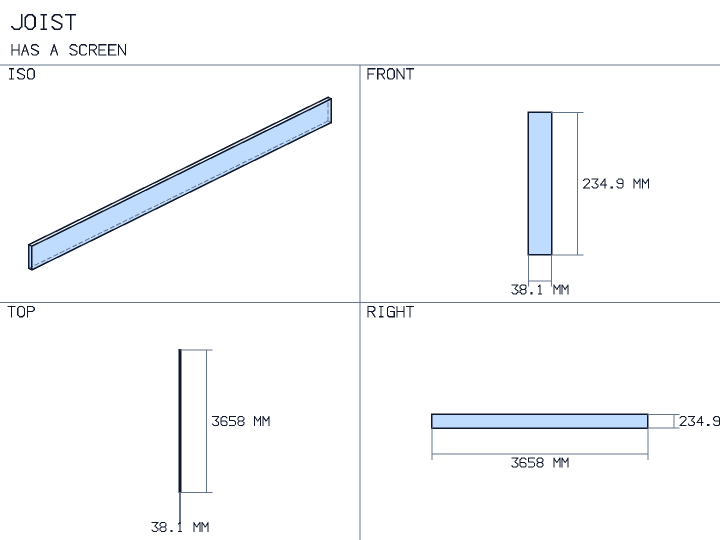

- Required: `name` (text), `width` (quantity), `depth` (quantity), `span` (quantity), `load` (quantity), `bending` (TimberDesignValue), `shear` (TimberDesignValue)
- Optional: `load_type` (distributed | point), `modulus` (TimberDesignValue), `bending_factors` (text | number), `shear_factors` (text | number), `modulus_factors` (text | number), `deflection_limit` (quantity), `sustained_load` (quantity), `creep_factor` (number), `bearing_length` (quantity), `bearing_end_distance` (quantity), `compression_perpendicular` (TimberDesignValue), `compression_perpendicular_factors` (text | number)
- Outputs: views, step, 3mf
- Example: [`examples/timber_joist.spec.yaml`](../examples/timber_joist.spec.yaml)

### `transmission_shaft`

A plain solid round shaft of one diameter and length.

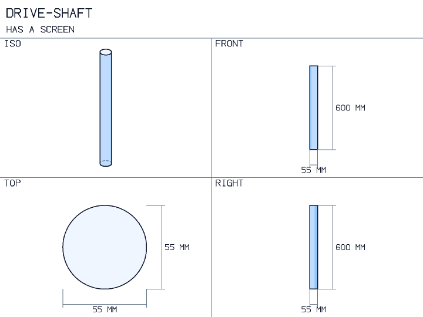

- Required: `diameter` (quantity), `bending_moment` (quantity), `torque` (quantity), `yield_strength` (quantity)
- Optional: `length` (quantity), `shear_modulus` (quantity), `allowable_twist` (quantity), `endurance_limit` (quantity), `ultimate_strength` (quantity)
- Outputs: views, step, 3mf
- Example: [`examples/transmission_shaft.spec.yaml`](../examples/transmission_shaft.spec.yaml)

### `tube`

A straight round or rectangular tube cut to length. **drawn, not checked**.

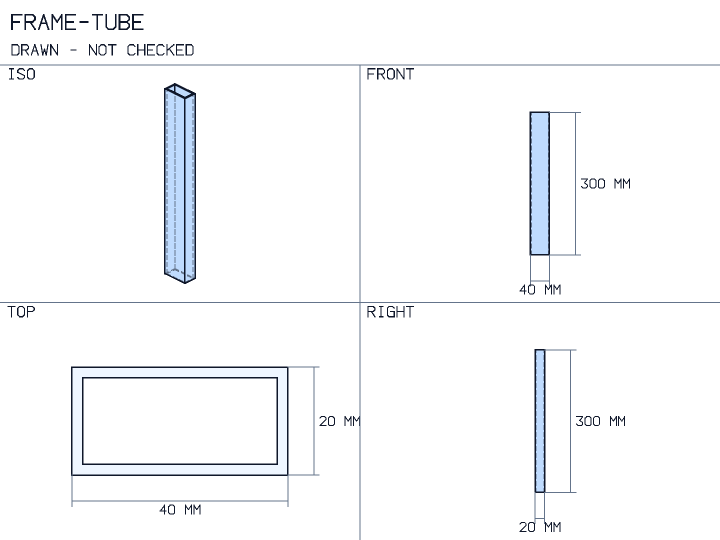

- Required: `name` (text), `wall` (quantity), `length` (quantity)
- Optional: `shape` (round | rectangular), `outer_diameter` (quantity), `width` (quantity), `height` (quantity), `material` (text)
- Outputs: views, step, 3mf
- Example: [`examples/parts/tube.spec.yaml`](../examples/parts/tube.spec.yaml)
